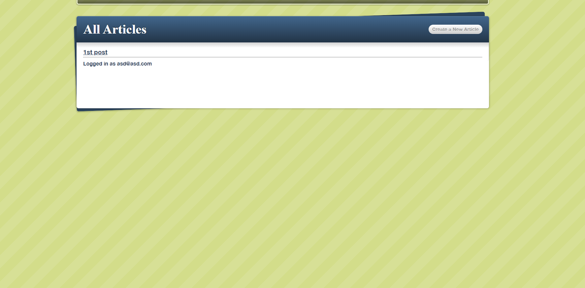

# Blog App using Ruby on Rails

This is the very first project we build with Ruby on Rails.

## Blog Screenshot

## Live Demo Link

[Click here to try the live Version on Heroku!](https://naked-ruby-blog.herokuapp.com/)

## Built With

- Ruby,
- Ruby on Rails,
- PostgreSQL.

## Authors

👤 **Hasan Kharouf**

- Github: [@wintercore](https://github.com/wintercore)

👤 **Gerónimo Morisot**

- Github: [@Bismarck-GM](https://github.com/Bismarck-GM)
- Twitter: [@Rewritablee](https://twitter.com/Rewritablee)
- Linkedin: [geronimomorisot](https://linkedin.com/in/geronimomorisot)

## 🤝 Contributing

Contributions, issues and feature requests are welcome!

## Show your support

Give a ⭐️ if you like this project!!
